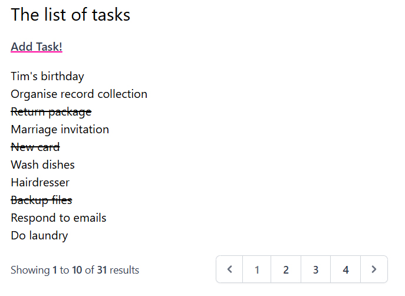
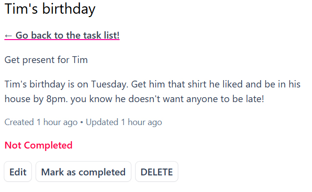
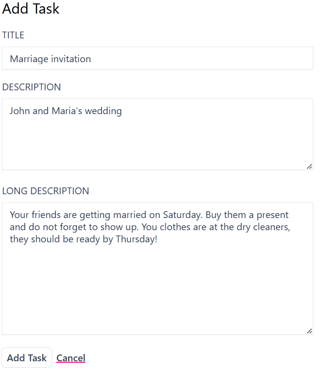

# ✅ Task Management App

## 📝 Overview
A simple task management app built with Laravel and Tailwind CSS. Users can create, edit, mark as completed, and delete tasks. The app uses a database for persistence, and sample data is generated using factories.

## 📸 Screenshots

## 🚀 Features
✔️ Add new tasks  
✔️ View all tasks in a list  
✔️ Mark tasks as completed (with strikethrough effect)  
✔️ Edit existing tasks  
✔️ Delete tasks  
✔️ Flash messages for user actions  
✔️ Uses Laravel factories to seed sample data

## 📌 Usage
* Open the app in your browser.
* View all tasks on the main page.
* Click "Add Task!" to create a new task.
* Click on a task to edit or mark it as completed.
* Use the delete button to remove a task.

## ❗ Known Issues
- No authentication (anyone can modify the tasks).
    - 🔹 This feature is planned for a future update.
